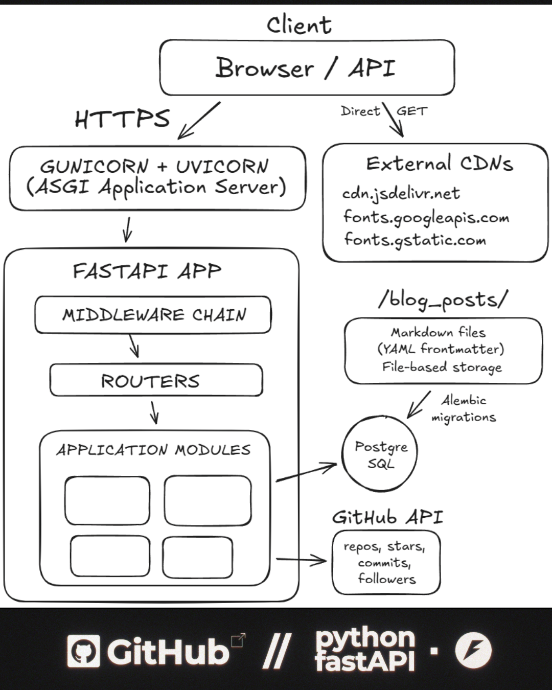

<div align="center">

  
  
  

  <h1>denys.dev</h1>
  <p>Personal portfolio & blog — FastAPI, DDD, Docker.</p>

</div>

---

<h3>System Architecture</h3>

<div align="center">
  
  <p>
    <em>
      Simplified architecture of the project.
    </em>
  </p>
</div>

<br />

<h3>Functional Showcase</h3>

<div align="center">

<table>
  <tr>
    <td align="center" valign="top" width="50%">
      <video src="" autoplay loop muted playsinline width="100%"></video>
      <br />
      <strong>Public Interface</strong>
      <br />
      <sub>
        Public portfolio.
      </sub>
    </td>
    <td align="center" valign="top" width="50%">
      <video src="" autoplay loop muted playsinline width="100%"></video>
      <br />
      <strong>Admin Interface</strong>
      <br />
      <sub>
        Admin interface.
      </sub>
    </td>
  </tr>
</table>

</div>

## Quick Start

```bash
git clone https://github.com/0xd3ny5/www.0xd3ny5.dev && cd me
cp .env.example .env        # edit SECRET_KEY, ADMIN_PASSWORD, etc.
make docker-up               # or: docker compose up -d --build
```

App → `http://localhost:8000` · Admin → `http://localhost:8000/admin`

Migrations run automatically on container start.

### Local (without Docker)

```bash
make venv && make install
cp .env.example .env
make migrate
make dev
```

Run `make help` for all available commands.

---

## Architecture

```
backend/
├── config/             # paths, settings (pydantic-settings), DI container
└── src/
    ├── domain/         # entities, repository & UoW interfaces
    ├── application/    # use cases, DTOs
    ├── infrastructure/ # SQLAlchemy models, repos, GitHub client, blog reader
    └── presentation/   # FastAPI routers, schemas, Jinja2 templates
```

Layered DDD: Domain → Application → Infrastructure → Presentation, wired via `dependency-injector`.

---

## Configuration

Copy `.env.example` → `.env` and set values:

| Variable | Default | Description |
|:--|:--|:--|
| `SECRET_KEY` | `change-me-in-production` | Random string, min 32 chars |
| `ADMIN_PASSWORD` | `admin` | Admin panel password |
| `DEBUG` | `false` | Enables `/docs` and disables HSTS |
| `DATABASE_URL` | `postgresql+asyncpg://...` | PostgreSQL connection |
| `ALLOWED_ORIGINS` | `["http://localhost:8000"]` | CORS origins (JSON array) |
| `ALLOWED_HOSTS` | `[]` | Trusted hosts (empty = disabled) |
| `GITHUB_TOKEN` | — | Optional, increases GitHub API rate limit |

---

## Middleware Stack

| Middleware | Purpose |
|:--|:--|
| **RequestId** | UUID per request, `X-Request-Id` header |
| **SecurityHeaders** | CSP, HSTS, X-Frame-Options, Referrer-Policy, Permissions-Policy |
| **GZip** | Response compression (>500 bytes) |
| **StaticCache** | `Cache-Control` for `/static/` (24h) |
| **TrustedHost** | Host header validation (prod only) |
| **CORS** | Configurable origin whitelist |

---

## Commands

| Command | Description |
|:--|:--|
| `make dev` | Dev server with hot reload |
| `make test` | Run tests |
| `make lint` | ruff + mypy |
| `make format` | Auto-fix and format |
| `make migrate` | Apply migrations |
| `make migration` | Generate new migration |
| `make docker-up` | Start services |
| `make docker-down` | Stop services |
| `make docker-restart` | Rebuild and restart |
